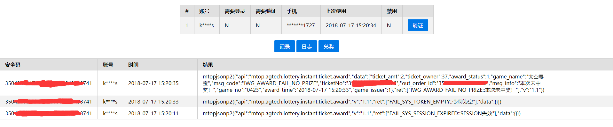
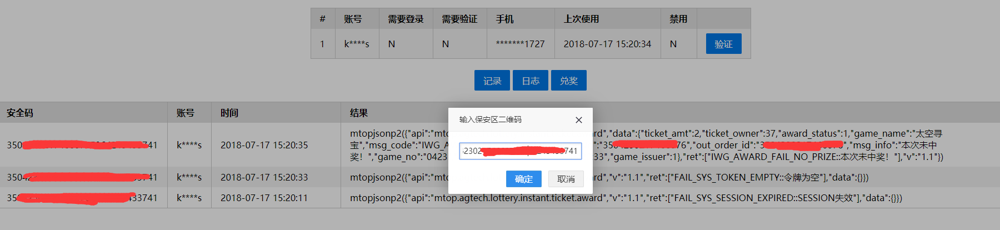
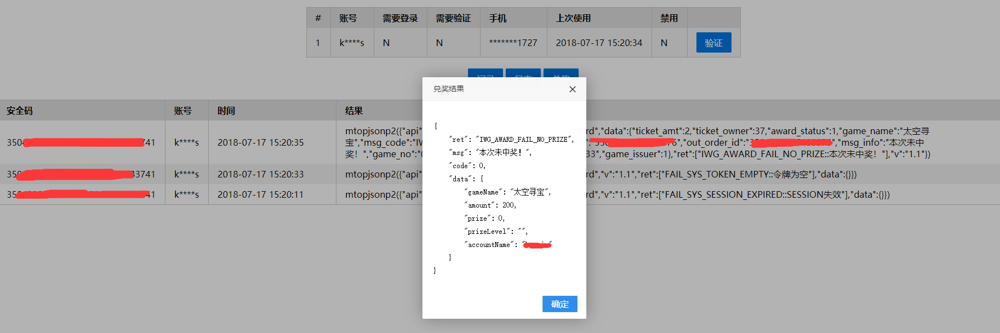

# 体彩兑奖接口
体育彩票顶呱刮类彩票淘宝兑奖程序

## 特性
* 支持全国体育彩票顶呱刮类彩票兑奖
* 使用淘宝api
* 支持多个支付宝账号，需通过实名认证
* 1000元以下直接到帐支付宝账号，1000元以上去体彩门店或体彩中心兑奖，10000元以上去体彩中心兑奖
* 自动登录，无需人工干预
* 自动轮询防止登录过期
* 提供http接口

## 使用方法
* 添加账号  
修改data/account.json文件，加入账号密码即可，如：
```
[
    {"name":"账号1","password":"密码1"}
    ,{"name":"账号2","password":"密码2"}
]
```

* 配置  
修改data/config.json文件  
开发环境dev  
生产环境prod，默认值  
配置项  
port  监听端口  
host  监听ip  
whiteList  ip白名单，不在白名单的ip访问api将返回403    

* 运行  

开发环境  
```
node index.js dev 
```
生产环境
```
node index.js
```

* API  
兑奖  /award/安全区二维码/物流二维码  
历史记录  /history/     
日志  /logs  
账号状态  /status  
短信验证  /verify


* 简易面板  
http://host:port/dashboard  
首页  
  
兑奖  
  
兑奖结果  



## 二次开发
* 兑奖后处理  
修改lib/Storage.js中的save方法，data结构如下
```
{
    "account":"支付宝账号",
    "secCode":"安全区二维码",
    "expressCode":"物流二维码",
    "result":{
        "gameName":"游戏名称",
        "amount":面额，单位分,
        "prize":奖金，单位分,
        "prizeLevel":"中奖级别",
        "accountName":"支付宝账号"
    },
    "raw":"支付宝返回原始结果"
}
```
## 注意事项
* 支付宝接口有访问速率限制，大规模使用需多个账号，程序自动按上次使用时间间隔长短选择账号。

## 代码
略
